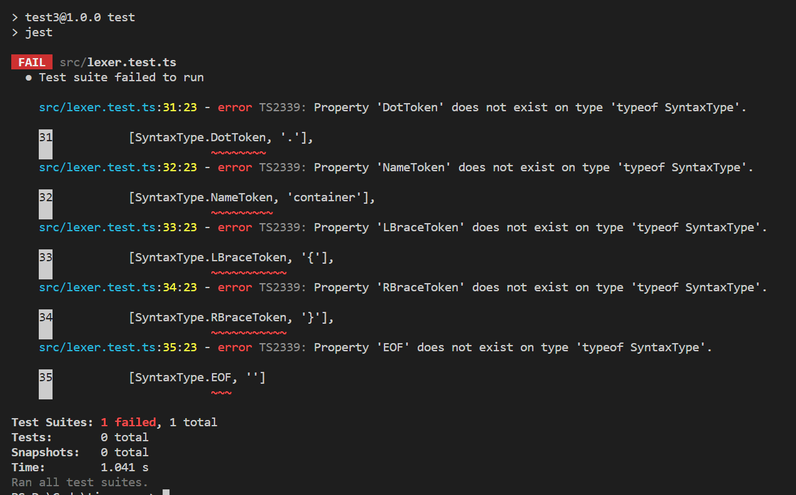

词法解析将由 lexer 完成，我们建立`lexer.ts`以及他的测试文件`lexer.test.ts`,和存储词法类型的文件`SyntaxType.ts`

src/lexer.test.ts

```typescript
import { lexer } from './lexer'
import { SyntaxType } from './SyntaxType'

describe('lexer', () => {
  interface LexerTestCase {
    input: string
    expectedTokens: Array<[syntaxType: SyntaxType, literal: string]>
  }

  const runLexerTests = (tests: LexerTestCase[]): void => {
    for (const tt of tests) {
      const { input, expectedTokens } = tt
      const actualTokens = lexer(input)

      expect(actualTokens.length).toBe(expectedTokens.length)
      for (let i = 0; i < actualTokens.length; ++i) {
        const actualToken = actualTokens[i]
        const expectToken = expectedTokens[i]
        expect(actualToken.type).toBe(expectToken[0])
        expect(actualToken.literal).toBe(expectToken[1])
      }
    }
  }

  test('lexes block', () => {
    const tests: LexerTestCase[] = [
      {
        input: `.container {
        }`,
        expectedTokens: [
          [SyntaxType.DotToken, '.'],
          [SyntaxType.NameToken, 'container'],
          [SyntaxType.LBraceToken, '{'],
          [SyntaxType.RBraceToken, '}'],
          [SyntaxType.EOF, '']
        ]
      }
    ]

    runLexerTests(tests)
  })
})
```

src/lexer.ts

```typescript
import { SyntaxType } from './SyntaxType'

export class Token {
  constructor(public type: SyntaxType, public literal: string) {}
}

export const lexer = (input: string): Token[] => {}
```

src/SyntaxType.ts

```typescript
export enum SyntaxType {}
```

如果你的`vscode`有安装`jest`插件的话已经可以在终端看到测试的结果了,也可以通过`npm run test`来手动运行测试，毫无疑问的测试失败了,提示我们还没有定义这些词法类型,下面我们就开始定义和解析这些词法类型


在完成以下代码后测试成功通过了


src/lexer.ts

```typescript
import { SyntaxType } from './SyntaxType'

export class Token {
  constructor(public type: SyntaxType, public literal: string) {}
}

export const lexer = (input: string): Token[] => {
  let idx = 0
  const n = input.length
  const tokens: Token[] = []
  const isLetter = (c: string): boolean =>
    (c >= 'a' && c <= 'z') || (c >= 'A' && c <= 'Z')
  const readName = (): string => {
    const start = idx

    while (idx < n && isLetter(input[idx])) ++idx

    return input.slice(start, idx)
  }

  while (idx < n) {
    switch (input[idx]) {
      case ' ':
      case '\t':
      case '\n':
      case '\r':
        idx++
        break
      case '.':
        tokens.push(new Token(SyntaxType.DotToken, '.'))
        ++idx
        break
      case '{':
        tokens.push(new Token(SyntaxType.LBraceToken, '{'))
        ++idx
        break
      case '}':
        tokens.push(new Token(SyntaxType.RBraceToken, '}'))
        ++idx
        break
      default: {
        if (isLetter(input[idx])) {
          const name = readName()
          tokens.push(new Token(SyntaxType.NameToken, name))
        } else {
          throw new Error(`Lexer: bad character ${input[idx]} at ${idx}`)
        }
      }
    }
  }

  tokens.push(new Token(SyntaxType.EOF, ''))
  return tokens
}
```

src/SyntaxType.ts

```typescript
export enum SyntaxType {
  DotToken = 'DotToken',
  NameToken = 'NameToken',
  LBraceToken = 'LBraceToken',
  RBraceToken = 'RBraceToken',
  EOF = 'EOF'
}
```

在 lexer 中我们通过建立一个`while`循环和内嵌的`switch`语句来处理遇到每一种字符时的情况，可以看到当我们遇到空格时就直接跳过开始解析下一个字符，当遇到 `.` 时就创建一个`DotToken`并`push`入反回数组中，其中最令人注意的还是我们在最后 `tokens.push(new Token(SyntaxType.EOF, ''))`手动创建了一个`EOF`，这又是干啥用的，实际上它并不对于任何的输入字符，但是却非常重要，它代表了输入的末尾，如果没有他我们将必须手动处理很多边缘 case,如果你处理过链表并且自己手动创建过哨兵节点来简化操作的话那你应该知道我在说什么,在枚举`SyntaxType`中我们使用了字符串作为枚举值这好像失去了使用枚举的意义(性能上)，这是处于方便调试的角度考虑的，打印一个数字而不是字符串让调试变得非常困难 ,而且就算以后我们想迁移到数字也只用改动这一个地方
