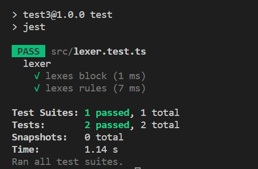

在这里我们要实现`rule`的解析也就是`height: 3px`这种语句的解析,首先我们添加下测试用例

/src/lexer.test.ts
```typescript
describe('lexer', () => {
  [...]

  test('lexes rules', () => {
    const tests: LexerTestCase[] = [
      {
        input: `div {
          color: red;
          height: 10px;
        }`,
        expectedTokens: [
          [SyntaxType.NameToken, 'div'],
          [SyntaxType.LBraceToken, '{'],
          [SyntaxType.NameToken, 'color'],
          [SyntaxType.ColonToken, ':'],
          [SyntaxType.NameToken, 'red'],
          [SyntaxType.SemicolonToken, ';'],
          [SyntaxType.NameToken, 'height'],
          [SyntaxType.ColonToken, ':'],
          [SyntaxType.ValueToken, '10px'],
          [SyntaxType.SemicolonToken, ';'],
          [SyntaxType.RBraceToken, '}'],
          [SyntaxType.EOF, '']
        ]
      },
      {
        input: `.container {
          div {
            height: 10px;
          }
        }
        `,
        expectedTokens: [
          [SyntaxType.DotToken, '.'],
          [SyntaxType.NameToken, 'container'],
          [SyntaxType.LBraceToken, '{'],
          [SyntaxType.NameToken, 'div'],
          [SyntaxType.LBraceToken, '{'],
          [SyntaxType.NameToken, 'height'],
          [SyntaxType.ColonToken, ':'],
          [SyntaxType.ValueToken, '10px'],
          [SyntaxType.SemicolonToken, ';'],
          [SyntaxType.RBraceToken, '}'],
          [SyntaxType.RBraceToken, '}'],
          [SyntaxType.EOF, '']
        ]
      }
    ]

    runLexerTests(tests)
  })
})
```

我们多添加了几种`token`比如`SemicolonToken`用来表示分号,`ValueToken`用来表示数字开头的值，等等，下面我们就开始添加和解析这几种 token 类型

src/SyntaxType.ts

```typescript
export enum SyntaxType {
  [...]

  ColonToken = 'ColonToken',
  SemicolonToken = 'SemicolonToken',
  ValueToken = 'ValueToken',

  [...]
}
```

src/lexer.ts

```typescript

export const lexer = (input: string): Token[] => {
  [...]
  const isDigit = (c: string): boolean => c >= '0' && c < '9'
  const readValue = (): string => {
    const start = idx

    while (idx < n && (isDigit(input[idx]) || isLetter(input[idx]))) ++idx

    return input.slice(start, idx)
  }

  while (idx < n) {
    switch (input[idx]) {
      [...]
      case ':':
        tokens.push(new Token(SyntaxType.ColonToken, ':'))
        ++idx
        break
      case ';':
        tokens.push(new Token(SyntaxType.SemicolonToken, ';'))
        ++idx
        break
      default: {
        if (isLetter(input[idx])) {
          const name = readName()
          tokens.push(new Token(SyntaxType.NameToken, name))
        } else if (isDigit(input[idx])) {
          const value = readValue()
          tokens.push(new Token(SyntaxType.ValueToken, value))
        } else {
          throw new Error(`Lexer: bad character ${input[idx]} at ${idx}`)
        }
      }
    }
  }

  [...]
}
```

好的运行测试，我们发现它已经能通过了


