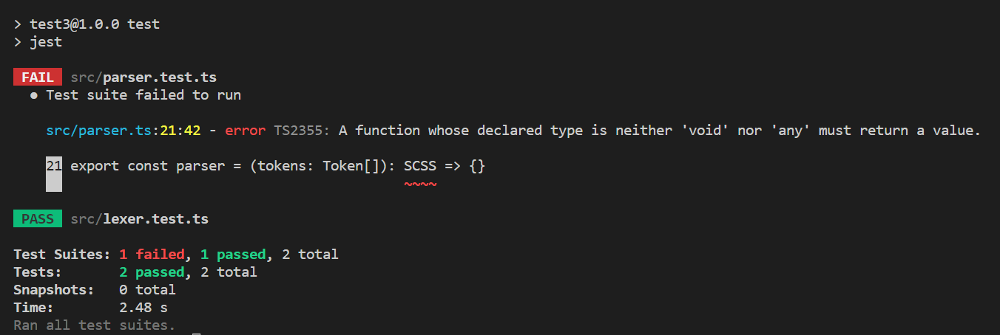
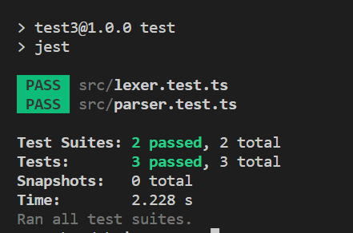

语法解析由`parser`模块完成，让我们先建好文件然后添加几个测试

src/parser.test.ts

```typescript
import { lexer, Token } from './lexer'
import { parser, Rule } from './parser'
import { SyntaxType } from './SyntaxType'

describe('parser', () => {
  interface ParserTestCase {
    input: string
    expectedAST: Record<string, any>
  }

  const runParserTests = (tests: ParserTestCase[]): void => {
    for (const tt of tests) {
      const { input, expectedAST } = tt
      const tokens = lexer(input)
      const actualAST = parser(tokens)

      expect(actualAST).toEqual(expectedAST)
    }
  }

  test('parsing simple nested block', () => {
    const tests: ParserTestCase[] = [
      {
        input: `.container {
            div {
               height: 10px;
            }
          }`,
        expectedAST: {
          type: SyntaxType.SCSS,
          content: [
            {
              type: SyntaxType.Block,
              selector: '.container',
              body: [
                {
                  type: SyntaxType.Block,
                  selector: 'div',
                  body: [
                    new Rule('height', new Token(SyntaxType.ValueToken, '10px'))
                  ]
                }
              ]
            }
          ]
        }
      }
    ]

    runParserTests(tests)
  })
})
```

src/parser.ts

```typescript
import { Token } from './lexer'
import { SyntaxType } from './SyntaxType'

export type SCSSChild = Block
export class SCSS {
  readonly type = SyntaxType.SCSS
  constructor(public content: SCSSChild[]) {}
}

export type BlockChild = SCSSChild | Rule
export class Block {
  readonly type = SyntaxType.Block
  constructor(public selector: string, public body: BlockChild[]) {}
}

export class Rule {
  readonly type = SyntaxType.Rule
  constructor(public name: string, public value: Token) {}
}

export const parser = (tokens: Token[]): SCSS => {}
```

src/SyntaxType.ts

```typescript
export enum SyntaxType {
  // Tokens
  DotToken = 'DotToken',
  NameToken = 'NameToken',
  LBraceToken = 'LBraceToken',
  RBraceToken = 'RBraceToken',
  ColonToken = 'ColonToken',
  SemicolonToken = 'SemicolonToken',
  ValueToken = 'ValueToken',
  EOF = 'EOF',

  // Nodes
  SCSS = 'SCSS',
  Block = 'Block',
  Rule = 'Rule'
}
```

测试没通过,因为我们什么 parse 逻辑都还没写


我们把节点类型(比如`SCSS`, `Block`, `Rule`)和`Token`类型全都放在了一个枚举类型`SyntaxType`中现在你应该知道原因了,应为它们对应类型的节点本质上都属于`AST`节点比如节点 Rule,他本身属于`AST`节点他的`value`子节点时`Token`类型的也属于`AST`节点

```typescript
export class Rule {
  readonly type = SyntaxType.Rule
  constructor(public name: string, public value: Token) {}
}
```

在添加以下 parse 逻辑后我们的测试成功的通过了

/src/parser.ts

```typescript
export const parser = (tokens: Token[]): SCSS => {
  let idx = 0
  const matchToken = (type: SyntaxType): Token => {
    if (tokens[idx].type !== type) {
      throw new Error(
        `expected SyntaxType ${type}, got=${tokens[idx].type} at index ${idx}`
      )
    }

    const token = tokens[idx]
    ++idx
    return token
  }
  const parseSCSS = (): SCSS => {
    const content = parseSCSSContent()
    matchToken(SyntaxType.EOF)

    return new SCSS(content)
  }

  const parseSCSSContent = (): SCSSChild[] => {
    const content: SCSSChild[] = []

    while (tokens[idx].type !== SyntaxType.EOF) {
      const block = parseBlock()
      content.push(block)
    }

    return content
  }

  const parseSelector = (): string => {
    let selector = ''
    if (tokens[idx].type === SyntaxType.DotToken) {
      selector += matchToken(SyntaxType.DotToken).literal
    }

    selector += matchToken(SyntaxType.NameToken).literal

    return selector
  }

  const parseBlockBody = (): BlockChild[] => {
    const body: BlockChild[] = []
    while (tokens[idx].type !== SyntaxType.RBraceToken) {
      if (
        tokens[idx].type === SyntaxType.NameToken &&
        tokens[idx + 1].type === SyntaxType.ColonToken
      ) {
        const rule = parseRule()
        body.push(rule)
      } else {
        const block = parseBlock()
        body.push(block)
      }
    }

    return body
  }

  const parseBlock = (): Block => {
    const selector = parseSelector()
    matchToken(SyntaxType.LBraceToken)
    const body = parseBlockBody()
    matchToken(SyntaxType.RBraceToken)

    return new Block(selector, body)
  }

  const parseRule = (): Rule => {
    const ruleNameToke = matchToken(SyntaxType.NameToken)
    matchToken(SyntaxType.ColonToken)
    let ruleValueToken: Token
    if (tokens[idx].type === SyntaxType.NameToken) {
      ruleValueToken = matchToken(SyntaxType.NameToken)
    } else {
      ruleValueToken = matchToken(SyntaxType.ValueToken)
    }
    matchToken(SyntaxType.SemicolonToken)

    return new Rule(ruleNameToke.literal, ruleValueToken)
  }

  return parseSCSS()
}
```



代码写出来了，现在我们可以说一下怎么把文法的生成式递推过程转换为代码的思路了，可以如果你仔细看一下我们已 parse 开头的那些函数的命名就可以发现这些函数与文法中的非终结符号是一一对应的比如`parseSCSS`就对应了文法中的非终结符号`SCSS`, `parseBlock`对应于`Block`,当然并没有这种强制规定比如在`parseBlock`时我们第一步就是要`parseSelector`,当然如果`Selector`的解析比较简单的话，我们完全不用单独建一个`parseSelector`函数, 可以直接在`parseBlock`函数体内完成`Selector`的解析，再比如`Name`和`Value`都是非终结符号但是我们却没有为他们建立 parse 函数，因为它们已经在词法解析阶段就完成了解析工作，我们可以直接使用`NameToken`和`ValueToken`来代替它们，当然如果你想也可以为每一个非终结符号都建立一个 parse 函数。

到这里我们已经可以如何将输入的词法单元序列转换为 AST 的通用思路了

1. 写出你要转换语言的文法在这里就是一个`SCSS`的简单子集
2. 为文法中的每个非终结符号建立一个 parse 函数(可选的不一定每个都要建)
3. 每一个`parse`函数都会返回一个和他对于的节点(比如`parseBlock`就会返回一个`Block`节点)
4. 根据生成式中的递推逻辑为每个`parse`填入内容就以`parseBlock`来说如果我们把他的递推式和函数体放在一起开的话就知道它们完全式等价的

```typescript
const parseBlock = (): Block => {
  const selector = parseSelector()
  matchToken(SyntaxType.LBraceToken)
  const body = parseBlockBody()
  matchToken(SyntaxType.RBraceToken)
  return new Block(selector, body)
}
```

```
Block   --->  Selector `{`
                BlockBody
              `}`
```

5. 根据递推式的逻辑将每个`parse`函数中终结符(比如左右大括号`{`和`}`)的 parse 换为`parser`中的`matchToken`工具函数的调用,将非终结符号的 parse 替换为它对应的`parse`函数的调用比如在处理`Selector`我们就会调用`parseSelector`,在处理`BlockBody`时就会调用`parseBlockBody`
6. 大功告成，如果我们调用`parser`一颗 AST 树就会自顶向下的过程被递推出来

不管你信不信，就算你之前没有任何相关的经验，我相信你现在已经具备了自主的编写一个将 json 字符串和 vue template 转换为 AST 的能力，但是仍然存在几个问题得说一下, 上面的这种方法当然不是万能的后面的章节中会做解释, 甚至我们在做二元表达式的解析时为了实现更加的简洁还会打破上面的规则。我们解析出来的语法树中语法信息是不完整的, 比如`Block`类中他只有两个子节点`selector`和`body`,我们回看一下`Block`生产式推导过程中产生的语法树发现他还有两个子节点分别是左右大括号 `{` 和 `}`,而且我们没有记录每个节点位置信息(几行几列在哪个文件)，比如说对于`eslint`这种工具来说他要求的语法树是每个节点都完整的，并且节点有完善的位置信息，否则他就无法完成检查一个大括号`{`前面是不是有一个空格,并修复这种问题的功能, 对于这个项目来说我们只想要程序尽可能的简单，而且我们最终的目的只是把`SCSS`转换为`CSS`而已，我们生成的这颗 AST 已经完全符合我们的需求,最后我们没有做`parser`过程中的错误处理可以看到在`matchToken`中我们遇到了一个和预期不符的节点直接就抛了一个异常，但是在完善的`parser`中应该处理这个`mismatch`然后尝试继续向后 parse 尝试找出更多错误，一次性展现给用户。
