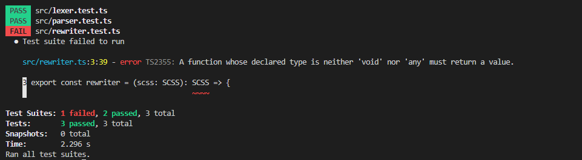
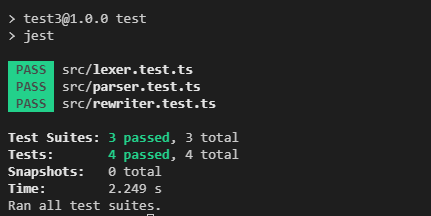

重写 AST 的工作由`rewriter`模块完成，我们先建好文件然后在添加几个测试用例

/src/rewriter.ts

```typescript
import { SCSS } from './parser'

export const rewriter = (scss: SCSS): SCSS => {}
```

/src/rewriter.test.ts

```typescript
import { lexer, Token } from './lexer'
import { parser, Rule } from './parser'
import { rewriter } from './rewriter'
import { SyntaxType } from './SyntaxType'

describe('rewriter', () => {
  interface RewriterTestCase {
    input: string
    expectedAST: Record<string, any>
  }
  const runRewriterTests = (tests: RewriterTestCase[]): void => {
    for (const tt of tests) {
      const { input, expectedAST } = tt
      const tokens = lexer(input)
      const ast = parser(tokens)
      const rewrittenAST = rewriter(ast)

      expect(rewrittenAST).toEqual(expectedAST)
    }
  }

  test('rewrite simple nested block', () => {
    const tests: RewriterTestCase[] = [
      {
        input: `.container {
                color: red;
                div {
                   height: 10px;
                }
              }`,
        expectedAST: {
          type: SyntaxType.SCSS,
          content: [
            {
              type: SyntaxType.Block,
              selector: '.container',
              body: [new Rule('color', new Token(SyntaxType.NameToken, 'red'))]
            },
            {
              type: SyntaxType.Block,
              selector: '.container div',
              body: [
                new Rule('height', new Token(SyntaxType.ValueToken, '10px'))
              ]
            }
          ]
        }
      }
    ]

    runRewriterTests(tests)
  })
})
```

现在测试还不能通过，让我们完成重写功能并让测试通过

添加以下代码后测试成功通过了



/src/rewriter.ts

```typescript
import { Block, BlockChild, Rule, SCSS, SCSSChild } from './parser'
import { SyntaxType } from './SyntaxType'

export const rewriter = (scss: SCSS): SCSS => {
  const rewriteSCSS = (scss: SCSS): SCSS => {
    const content = rewriteSCSSContent(scss.content)
    return new SCSS(content)
  }

  const rewriteSCSSContent = (content: SCSSChild[]): SCSSChild[] => {
    const children: SCSSChild[] = []
    for (const node of content) {
      switch (node.type) {
        case SyntaxType.Block: {
          const block = rewriteBlock(node)
          if (Array.isArray(block)) {
            children.push(...block)
          } else {
            children.push(block)
          }
          break
        }
        default:
          throw new Error(
            // eslint-disable-next-line @typescript-eslint/restrict-template-expressions
            `RewriteSCSSContent: unexpected NodeType ${node.type}`
          )
      }
    }

    return children
  }

  const rewriteBlock = (block: Block): Block | Block[] => {
    const needsRewrite = block.body.some((v) => v.type === SyntaxType.Block)

    if (!needsRewrite) return block

    const blocks: Block[] = []
    const blockBody: BlockChild[] = []
    blocks.push(new Block(block.selector, blockBody))

    for (const node of block.body) {
      switch (node.type) {
        case SyntaxType.Block: {
          const { selector, body } = node
          const newBlock = new Block(block.selector + ' ' + selector, body)
          const rewrittenBlock = rewriteBlock(newBlock)
          if (Array.isArray(rewrittenBlock)) {
            blocks.push(...rewrittenBlock)
          } else {
            blocks.push(rewrittenBlock)
          }
          break
        }
        case SyntaxType.Rule:
          blockBody.push(rewriteRule(node))
          break
        default:
          throw new Error(
            `RewriteBlock: unexpected NodeType ${(node as BlockChild).type}`
          )
      }
    }

    return blocks
  }

  const rewriteRule = (rule: Rule): Rule => {
    return rule
  }

  return rewriteSCSS(scss)
}
```

在重写的逻辑中我们会为每种类型的节点建立一个`rewrite`函数,该函数会接收要重写的节点然后返回重写后的节点, 在其中我们干的事不多，只是把嵌套的`Block`递归的不断拍平， 要意识到重写出来的 AST 仍然是有格式限制的就好像我们写代码时不能在函数外部使用`return`语句，我们重写后的 AST 也必须是一颗合法的符合该语言文法的 AST,否则在下个阶段可能会产生问题,现在我们已经确认`rewriter`生成的 AST 已经兼容`CSS`的格式了,接下来我们可以开始着手`CSS`的生成工作了
