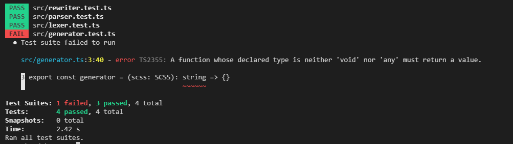
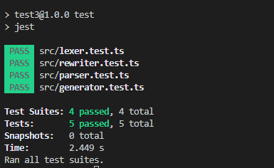

生成 CSS，由`generator`模块完成，我们先建好文件然后在添加几个测试用例

/src/generator.ts

```typescript
import { SCSS } from './parser'

export const generator = (scss: SCSS): string => {}
```

/src/generator.test.ts

```typescript
import { generator } from './generator'
import { lexer } from './lexer'
import { parser } from './parser'
import { rewriter } from './rewriter'

describe('generator', () => {
  interface GeneratorTestCase {
    input: string
    expected: string
  }

  const runGeneratorTests = (tests: GeneratorTestCase[]): void => {
    for (const tt of tests) {
      const { input, expected } = tt
      const expectedLines = expected
        .split('\n')
        .map((v) => v.trim())
        .filter(Boolean)
      const tokens = lexer(input)
      const ast = parser(tokens)
      const flattenedAST = rewriter(ast)
      const actualCSS = generator(flattenedAST)
      const actualLines = actualCSS
        .split('\n')
        .map((v) => v.trim())
        .filter(Boolean)

      expect(actualLines.length).toBe(expectedLines.length)

      for (let i = 0; i < actualLines.length; ++i) {
        expect(actualLines[i]).toBe(expectedLines[i])
      }
    }
  }

  test('generate simple nested block', () => {
    const tests: GeneratorTestCase[] = [
      {
        input: `.container {
            color: red;
            div {
               height: 10px;
            }
          }`,
        expected: `
        .container {
          color: red;
        }
        .container div {
          height: 10px;
        }
        `
      }
    ]

    runGeneratorTests(tests)
  })
})
```

现在测试还不能通过，让我们完成`generator`功能并让测试通过


加入以下逻辑后测试通过了



/src/generator.ts

```typescript
import { Block, BlockChild, Rule, SCSS, SCSSChild } from './parser'
import { SyntaxType } from './SyntaxType'

export const generator = (scss: SCSS): string => {
  const identUnit = 2
  let ident = 0

  const generateSCSS = (scss: SCSS): string => {
    return generateSCSSContent(scss.content)
  }

  const generateSCSSContent = (content: SCSSChild[]): string => {
    let css = ''
    for (const node of content) {
      switch (node.type) {
        case SyntaxType.Block:
          css += generateBlock(node)
          break
        default:
          throw new Error(
            // eslint-disable-next-line @typescript-eslint/restrict-template-expressions
            `GenerateSCSSContent: unexpected NodeType ${node.type}`
          )
      }
    }

    return css
  }

  const generateBlock = (block: Block): string => {
    const prefix = ' '.repeat(ident * identUnit)
    let css = prefix + block.selector + ' {\n'

    ++ident

    for (const node of block.body) {
      switch (node.type) {
        case SyntaxType.Block:
          css += generateBlock(node)
          break
        case SyntaxType.Rule:
          css += generateRule(node)
          break
        default:
          throw new Error(
            `GenerateBlock: unexpected NodeType ${(node as BlockChild).type}`
          )
      }
    }

    --ident

    css += '}\n'

    return css
  }

  const generateRule = (rule: Rule): string => {
    const prefix = ' '.repeat(ident * identUnit)
    return prefix + rule.name + ': ' + rule.value.literal + ';\n'
  }

  return generateSCSS(scss)
}
```

同样没啥复杂的逻辑，只需要为生成的节点类型写一个`generate`函数然后在互相之间根据关系递归调用即可
