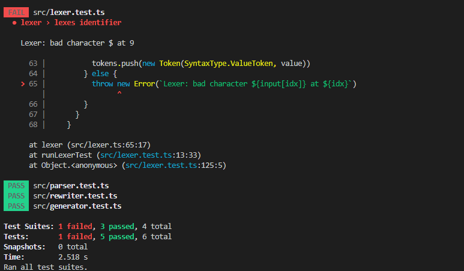
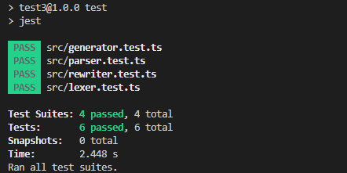
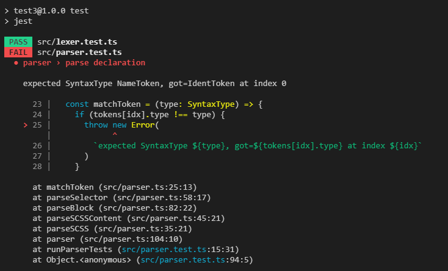
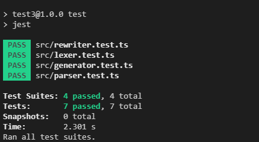
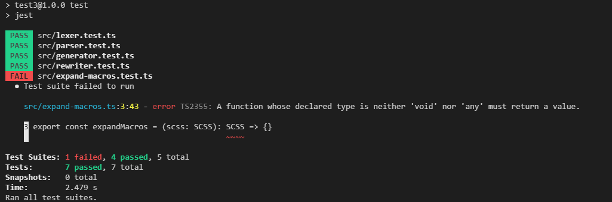
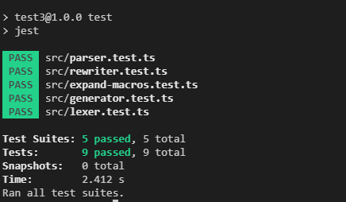
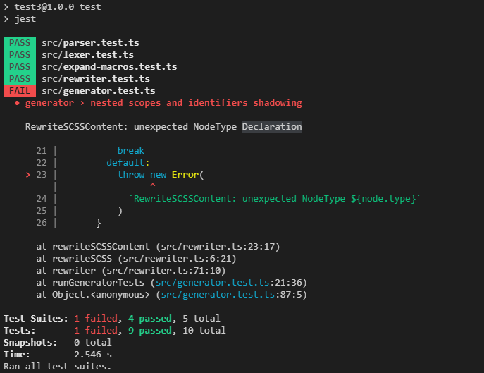
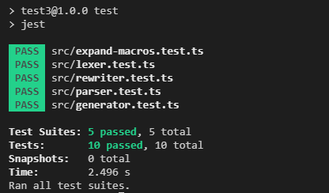

## 1. 让 lexer 能解析标识符

在这个小节中我们先完成宏拓展的块级作用域和变量功能,首先我们需要让`lexer`支持变量的解析，让我们为`lexer`添加新的测试用例

/src/SyntaxType.ts

```typescript
export enum SyntaxType {
  // Tokens
  [...]
  IdentToken = 'IdentToken',

  // Nodes
  [...]
}
```

/src/lexer.test.ts

```typescript
import { lexer } from './lexer'
import { SyntaxType } from './SyntaxType'

describe('lexer', () => {
  [...]

  test('lexes identifier', () => {
    const tests: LexerTestCase[] = [
      {
        input: `
        $primary-color: red;
        $base-width: 10px;
        $lh: 10;
        $test1: 1;
        $test1-3: 2;
        color: $primary-color;
        `,
        expectedTokens: [
          [SyntaxType.IdentToken, '$primary-color'],
          [SyntaxType.ColonToken, ':'],
          [SyntaxType.NameToken, 'red'],
          [SyntaxType.SemicolonToken, ';'],

          [SyntaxType.IdentToken, '$base-width'],
          [SyntaxType.ColonToken, ':'],
          [SyntaxType.ValueToken, '10px'],
          [SyntaxType.SemicolonToken, ';'],

          [SyntaxType.IdentToken, '$lh'],
          [SyntaxType.ColonToken, ':'],
          [SyntaxType.ValueToken, '10'],
          [SyntaxType.SemicolonToken, ';'],

          [SyntaxType.IdentToken, '$test1'],
          [SyntaxType.ColonToken, ':'],
          [SyntaxType.ValueToken, '1'],
          [SyntaxType.SemicolonToken, ';'],

          [SyntaxType.IdentToken, '$test1-3'],
          [SyntaxType.ColonToken, ':'],
          [SyntaxType.ValueToken, '2'],
          [SyntaxType.SemicolonToken, ';'],

          [SyntaxType.NameToken, 'color'],
          [SyntaxType.ColonToken, ':'],
          [SyntaxType.IdentToken, '$primary-color'],
          [SyntaxType.SemicolonToken, ';'],

          [SyntaxType.EOF, '']
        ]
      }
    ]

    runLexerTests(tests)
  })
})

```

现在测试还不能通过，提示我们不能识别 `$` 符号，让我们完成功能并让测试通过


只需加入几行代码测试就能通过

/src/lexer.ts

```typescript
export const lexer = (input: string): Token[] => {
  const readName = (): string => {
    const start = idx

    while (
      (idx < n && isLetter(input[idx])) ||
      isDigit(input[idx]) ||
      input[idx] === '-'
    ) {
      ++idx
    }

    return input.slice(start, idx)
  }

  while (idx < n) {
    switch (input[idx]) {
      [...]
      default: {
        if (isLetter(input[idx])) {
          const name = readName()
          tokens.push(new Token(SyntaxType.NameToken, name))
        } else if (isDigit(input[idx])) {
          const value = readValue()
          tokens.push(new Token(SyntaxType.ValueToken, value))
        } else if (input[idx] === '$' && isLetter(input[idx + 1])) {
          ++idx
          const name = readName()
          tokens.push(new Token(SyntaxType.IdentToken, '$' + name))
        } else {
          throw new Error(`Lexer: bad character '${input[idx]}' at ${idx}`)
        }
      }
    }
  }

  tokens.push(new Token(SyntaxType.EOF, ''))
  return tokens
}
```

我们加入了 `input[idx] === '$'`的分支并且修改了`readName`的逻辑添加了`input[idx] === '-' || isDigit(input[idx])`让`-`符号和数字能出现在`NameToken`中，测试成功通过,现在`lexer`能够解析标识符了



## 2. 让 parser 支持标识符和声明语句的语法分析

让我们修改一下原先文法以支持新加入的标识符

```
SCSS           --->  SCSSContent
SCSSContent    --->  (Block | Declaration)*
Block          --->  Selector `{`
                       BlockBody
                     `}`
Selector       --->  `.`? Name
BlockBody      --->  (Rule | Block | Declaration)*
Declaration    --->  Identifier `:` Expression `;`
Identifier     --->  `$` Name
Name           --->  [a-zA-Z]+
Rule           --->  Name `:` Expression `;`
Expression     --->  Name | Value | Identifier
Value          --->  [0-9]+ Name?
```

可以看到为了支持标识符在`SCSSContent`和`BlockBody`的右侧都加入的`Declaration`，其中
`Declaration`又可以推导出一个声明语言由一个`$`号开头的标识符跟着一个`:`号然后后面再跟着这个标识符的要绑定值最后以`;`号结尾, `Rule`和`Declaration`的右部都是`Expression`其中`Expression`又可是推导出`Name`,`Value`或者`Identifier`。让我们为`parser`添加一些测试用例。

/src/parser.test.ts

```typescript
import { lexer, Token } from './lexer'
import { parser, Rule } from './parser'
import { SyntaxType } from './SyntaxType'

describe('parser', () => {
  [...]

  test('parse declaration and identifier', () => {
    const tests: ParserTest[] = [
      {
        input: `
      $primary-color: red;
      .container {
        $width-sm: 10px;
        color: $primary-color;
      }
      `,
        expectedAST: {
          type: SyntaxType.SCSS,
          content: [
            {
              type: SyntaxType.Declaration,
              name: '$primary-color',
              value: new Token(SyntaxType.NameToken, 'red'),
            },
            {
              type: SyntaxType.Block,
              selector: '.container',
              body: [
                {
                  type: SyntaxType.Declaration,
                  name: '$width-sm',
                  value: new Token(SyntaxType.ValueToken, '10px'),
                },
                new Rule(
                  'color',
                  new Token(SyntaxType.IdentToken, '$primary-color')
                ),
              ],
            },
          ],
        },
      },
    ]

    runParserTests(tests)
  })
})
```



测试失败了,应为在`parseSCSSContent`还以为只有`Block`一种子节点所以把`Declaration`当作了`Block`解析当然会失败,让我们添加 parse 逻辑并让测试通过

/src/SyntaxType.ts

```typescript
export enum SyntaxType {
  // Nodes
  [...]
  Declaration = 'Declaration',
}
```

/src/parser.test.ts

```typescript
export type SCSSChild = Block | Declaration
export type BlockChild = SCSSChild | Rule
export type Expression = Token

export class Rule {
  readonly type = SyntaxType.Rule
  constructor(public name: string, public expression: Expression) {}
}

export class Declaration {
  readonly type = SyntaxType.Declaration
  constructor(public name: string, public expression: Expression) {}
}

export const parser = (tokens: Token[]): SCSS => {
  [...]

  const parseSCSSContent = (): SCSSChild[] => {
    const content: SCSSChild[] = []

    while (tokens[idx].type !== SyntaxType.EOF) {
      const child = parseSCSSChild()
      content.push(child)
    }

    return content
  }

  const parseSCSSChild = (): SCSSChild => {
    switch (tokens[idx].type) {
      case SyntaxType.IdentToken:
        return parseDeclaration()
      default:
        return parseBlock()
    }
  }

  const parseExpression = (): Expression => {
    const token = tokens[idx]
    switch (token.type) {
      case SyntaxType.IdentToken:
      case SyntaxType.NameToken:
      case SyntaxType.ValueToken:
        ++idx
        return token
      default:
        throw new Error(`ParseExpression: unexpected NodeType '${token.type}'`)
    }
  }

  const parseDeclaration = (): Declaration => {
    const identToken = matchToken(SyntaxType.IdentToken)
    matchToken(SyntaxType.ColonToken)
    const expr = parseExpression()
    matchToken(SyntaxType.SemicolonToken)

    return new Declaration(identToken.literal, expr)
  }

  const parseBlockBody = (): BlockChild[] => {
    const body: BlockChild[] = []
    while (tokens[idx].type !== SyntaxType.RBraceToken) {
      if (
        tokens[idx].type === SyntaxType.NameToken &&
        tokens[idx + 1].type === SyntaxType.ColonToken
      ) {
        const rule = parseRule()
        body.push(rule)
      } else {
        const child = parseSCSSChild()
        body.push(child)
      }
    }

    return body
  }

  const parseRule = (): Rule => {
    const ruleNameToke = matchToken(SyntaxType.NameToken)
    matchToken(SyntaxType.ColonToken)
    const expr = parseExpression()
    matchToken(SyntaxType.SemicolonToken)

    return new Rule(ruleNameToke.literal, expr)
  }

  return parseSCSS()
}
```

和之前提到的规则相同我们按照需求为每个非终结符添加对于的`parse`函数(再次重申一遍这不是必须的一切更具需求来)，然后根据产生式的内容为其`parse`填写内容，下面是具体更改和新增的东西: <br>

- 添加了新的类型定义`Expression` <br>
- 添加了新的节点类型`Declaration` <br>
- 现在`Declaration`和`Rule`的值都是`Expression`而不是 `Token`了 <br>
- 添加了新的`parse`函数`parseDeclaration`和`parseExpression` <br>
- 考虑到`BlockBody`和`SCSSContent`唯一的区别就是`SCSSContent`中不能出现`Rule`所以我们用新建了一个公共方法`parseSCSSChild`，他在`parseSCSSContent`和`parseBlockBody`中都可以使用,现在测试已经能成功通过



---

## 3. 在宏拓展阶段展开标识符

终于到宏拓展阶段了, 它由`expand-macros`模块完成，我们先建好文件然后添加些测试用例

/src/expand-macros.test.ts

```typescript
import { expandMacros } from './expand-macros'
import { lexer, Token } from './lexer'
import { parser, Rule } from './parser'
import { SyntaxType } from './SyntaxType'

describe('expand-macros', () => {
  interface ExpandMacrosTestCase {
    input: string
    expectedAST: Record<string, any>
  }

  const runExpandMacrosTests = (tests: ExpandMacrosTestCase[]): void => {
    for (const tt of tests) {
      const { input, expectedAST } = tt
      const tokens = lexer(input)
      const ast = parser(tokens)
      const expandedAST = expandMacros(ast)

      expect(expandedAST).toEqual(expectedAST)
    }
  }

  test('test nested scopes', () => {
    const tests: ExpandMacrosTestCase[] = [
      {
        input: `
            $fc: red;
            $bc: blue;
            .container {
              height: 10px;
              $bc: pink;
              color: $fc;
              background-color: $bc; 
            }

            .box {
              color: $fc;
              background-color: $bc;
            }
            `,
        expectedAST: {
          type: SyntaxType.SCSS,
          content: [
            {
              type: SyntaxType.Block,
              selector: '.container',
              body: [
                new Rule('height', new Token(SyntaxType.ValueToken, '10px')),
                new Rule('color', new Token(SyntaxType.NameToken, 'red')),
                new Rule(
                  'background-color',
                  new Token(SyntaxType.NameToken, 'pink')
                )
              ]
            },
            {
              type: SyntaxType.Block,
              selector: '.box',
              body: [
                new Rule('color', new Token(SyntaxType.NameToken, 'red')),
                new Rule(
                  'background-color',
                  new Token(SyntaxType.NameToken, 'blue')
                )
              ]
            }
          ]
        }
      }
    ]

    runExpandMacrosTests(tests)
  })

  test('expand expressions', () => {
    const tests: ExpandMacrosTestCase[] = [
      {
        input: `
        .container {
          $a: 1;
          $b: 1px;
          $c: red;
          $d: $c;
          height: $a;
          height: $b;
          height: $c;
          height: $d;
        }
            `,
        expectedAST: {
          type: SyntaxType.SCSS,
          content: [
            {
              type: SyntaxType.Block,
              selector: '.container',
              body: [
                new Rule('height', new Token(SyntaxType.ValueToken, '1')),
                new Rule('height', new Token(SyntaxType.ValueToken, '1px')),
                new Rule('height', new Token(SyntaxType.NameToken, 'red')),
                new Rule('height', new Token(SyntaxType.NameToken, 'red'))
              ]
            }
          ]
        }
      }
    ]

    runExpandMacrosTests(tests)
  })
})
```

/scr/expand-macros.ts

```typescript
import { SCSS } from './parser'

export const expandMacros = (scss: SCSS): SCSS => {}
```

从测试的内容我们就可以看到展开标识符要干些什么了，在第一个测试中我们测试了块级作用域效果，内层声明的同名变量会被优先使用,第二个测试我们测试 expression 是否被正确的展开，当然现在测试不能正常通过了,让我们编写宏拓展的逻辑。


现在`$primary-color`这类声明右部的值被抽象成为了`Expression`也就是表达式，现在表达式的类型还只有`ValueToken`和`NameToken`, `IdentToken`以后我们会添加更多的表达式，比如二元表达式，和调用表达式, 要将一个表达式的结果绑定给一个标识符之前肯定得对其先求值,例如`$a: 3px + 4px`,我们应给`$a`绑定一个`7px`的值而不是表达式本身,所以目前我们需要一种内部表示来存放这些求值产生的结果

/src/expandMacros.ts

```typescript
type SCSSObject = StringObject | NumberObject
enum SCSSObjectType {
  String = 'String',
  Number = 'Number'
}
class StringObject {
  readonly type = SCSSObjectType.String
  constructor(public value: string) {}
  toString = (): string => this.value
}
class NumberObject {
  readonly type = SCSSObjectType.Number
  constructor(public value: number, public unit: string | null) {}
  toString = (): string => `${this.value}${this.unit ?? ''}`
}
```

我们首先建立了一个`SCSSObject`的类型它代表了求值可能产生的所有数据类型,目前还只有`StringObject`和`NumberObject`, 我想目的已经很明确了, 像`red`这种字符串字面量应该求值为`StringObject`,而像`7px`以数字开头的值应该求值为`NumberObject`我们还会顺便求出他的单位`px`,标识符和他要绑定的值都有了，我们还需要作用域,因为一个标识符总是应该和一个作用域绑定

src/expandMacros.ts

```typescript
class Scope {
  private symbols?: Record<string, SCSSObject>

  constructor(private readonly parent: Scope | null) {}

  addSymbol(name: string, object: SCSSObject): void {
    if (this.symbols == null) {
      this.symbols = {}
    }

    this.symbols[name] = object
  }

  lookup(name: string): SCSSObject | null {
    const obj = this.symbols?.[name]
    if (obj == null) {
      return this.parent?.lookup(name) ?? null
    }

    return obj
  }
}
```

可以看到`Scope`有一个`symbols`字段存放了该作用域中所有的标识符，他还有一个`parent`字段指向他的父级作用域,最顶层作用域的`parent`为`null`, `addSymbol`方法可以在该作用域中添加一个标识符,可以看到`symbols`字段是懒创建的如果该作用域一个字段都没有那么就没有必要初始化`symbols`字段，`lookup`可以在该作用域中查找一个标识符并返回它绑定的值，首先会尝试查找标识符是否在该作用域存在，如果不存在则会到它的父级作用域查找，如果都找不到则返回`null`

接下来就真的到了展开宏的逻辑了，我们首先要区分像 mixin 这种输入 AST 然后返回展开后 AST 
和 function 这种输入表达式返回内部求值结果的两种形式
第一种类型我们会为它们建立`expand`的函数，第二种类型我们会为它们建立`eval`函数，具体可以看下面的代码

/src/expandMacros.ts

```typescript
import { Token } from './lexer'
import {
  Block,
  BlockChild,
  Declaration,
  Expression,
  Rule,
  SCSS,
  SCSSChild,
} from './parser'
import { SyntaxType } from './SyntaxType'

[...]

export const expandMacros = (scss: SCSS): SCSS => {
  const evalValueToken = (token: Token): NumberObject => {
    const literal = token.literal
    let n = literal.length
    let i = n - 1
    for (; i >= 1; --i) {
      const isLetter = literal[i] >= 'a' && literal[i] <= 'z'
      if (!isLetter) break
    }

    return new NumberObject(
      parseFloat(literal),
      i + 1 === n ? null : literal.slice(i + 1)
    )
  }
  const evalExpression = (expr: Expression, scope: Scope) => {
    switch (expr.type) {
      case SyntaxType.IdentToken: {
        const { literal } = expr as Token
        const obj = scope.lookup(literal)

        if (obj === null) {
          throw new Error(`EvalExpression: '${literal}' is not defined`)
        }
        return obj
      }
      case SyntaxType.NameToken:
      case SyntaxType.NameToken:
        const { literal } = expr as Token
        return new StringObject(literal)
      case SyntaxType.ValueToken:
        return evalValueToken(expr as Token)
      default:
        throw new Error(`EvalExpression: unexpected NodeType '${expr.type}'`)
    }
  }

  const expandSCSS = (scss: SCSS, scope: Scope): SCSS => {
    const content = expandSCSSContent(scss.content, scope)
    return new SCSS(content)
  }

  const expandSCSSContent = (
    content: SCSSChild[],
    scope: Scope
  ): SCSSChild[] => {
    const children: SCSSChild[] = []
    for (const node of content) {
      const child = expandSCSSChild(node, scope)
      if (child !== null) {
        children.push(child)
      }
    }

    return children
  }

  const expandSCSSChild = (node: SCSSChild, scope: Scope): SCSSChild | null => {
    switch (node.type) {
      case SyntaxType.Block:
        return expandBlock(node as Block, scope)
      case SyntaxType.Declaration:
        return expandDeclaration(node as Declaration, scope)
      default:
        throw new Error(
          `ExpandSCSSChild: unexpected NodeType '${(node as SCSSChild).type}'`
        )
    }
  }

  const expandBlock = (block: Block, scope: Scope): Block => {
    const body: BlockChild[] = []
    const blockScope = new Scope(scope)
    for (const node of block.body) {
      switch (node.type) {
        case SyntaxType.Rule:
          body.push(expandRule(node as Rule, blockScope))
          break
        default:
          const child = expandSCSSChild(node as SCSSChild, blockScope)
          if (child !== null) {
            body.push(child)
          }
      }
    }

    return new Block(block.selector, body)
  }

  const expandRule = (rule: Rule, scope: Scope): Rule => {
    const { value, name } = rule
    if (
      value.type === SyntaxType.NameToken ||
      value.type === SyntaxType.ValueToken
    ) {
      return rule
    }

    const obj = evalExpression(value, scope)
    return new Rule(
      name,
      new Token(
        obj.type === SCSSObjectType.Number
          ? SyntaxType.ValueToken
          : SyntaxType.NameToken,
        obj.toString()
      )
    )
  }

  const expandDeclaration = (decl: Declaration, scope: Scope) => {
    const obj = evalExpression(decl.expression, scope)
    scope.addSymbol(decl.name, obj)
    return null
  }

  const globalScope = new Scope(null)
  return expandSCSS(scss, globalScope)
}
```

和 `parser` 类似由于宏展开时`Block`和`SCSSContent`的子节点除了`Rule`其他全都一模一样所有我们编写了一个`expandSCSSChild`的通用展开函数，`expandBlock`和`expandSCSSContent`中都可以调用，并不是所有节点展开后都有值，像`$c: 3px`这种声明语句展开后并不会产生任何 AST 节点它们承载的更多的时运行时的意义,在这里他会在当前的作用域中添加一个名为`$c`值为`NumberObject{value: 3, unit: "px"}`的标识符,所以我们要注意做好`null`值的判断。基本思路和我们上面描述的一致，我们为需要求值的节点比如`Expression`建立`eval`函数，为需要展开的节点比如`Block`或者`Rule`建立`expand`函数，再次运行测试，测试成功通过。



还没完我们需要在为`generator`添加几个测试用例，对全流程都进行一遍测试确保我们没改坏东西

/src/generator.test.ts

```typescript
[...]

describe('generator', () => {
  [...]

  test('nested scopes and identifiers shadowing', () => {
    const tests: GeneratorTestCase[] = [
      {
        input: `
            $primary-color: red;
            $secondary-color: blue;
            .container {
              color: $primary-color;
              $secondary-color: pink;
              background-color: $secondary-color;
            }
            .box {
              color: $secondary-color;
            }
            `,
        expected: `
            .container {
              color: red;
              background-color: pink;
            }

            .box {
              color: blue;
            }
            `,
      },
    ]

    runGeneratorTests(tests)
  })
})
```

再次运行测试，测试没有通过说是在重写阶段出现了未预料的节点类型`Declaration`,是啊我们应该先将 AST 中的宏展开然后在给 rewriter 重写



我们需要修改下 `runGeneratorTests` 函数在把 AST 传给 `rewriter` 之前先调用`expandMacros`将其中的宏展开

/src/generator.test.ts

```typescript
describe('generator', () => {
  [...]

  const runGeneratorTests = (tests: GeneratorTestCase[]) => {
    for (const tt of tests) {
      [...]

      const ast = parser(tokens)
      const expandedAST = expandMacros(ast)
      const flattenedAST = rewriter(expandedAST)
      const actualCSS = generator(flattenedAST)

      [...]
    }
  }

  [...]
})

```

再次运行测试，成功通过



好了大功告成，所有的模块都有了后面需要做的事，就是在上面添砖加瓦
