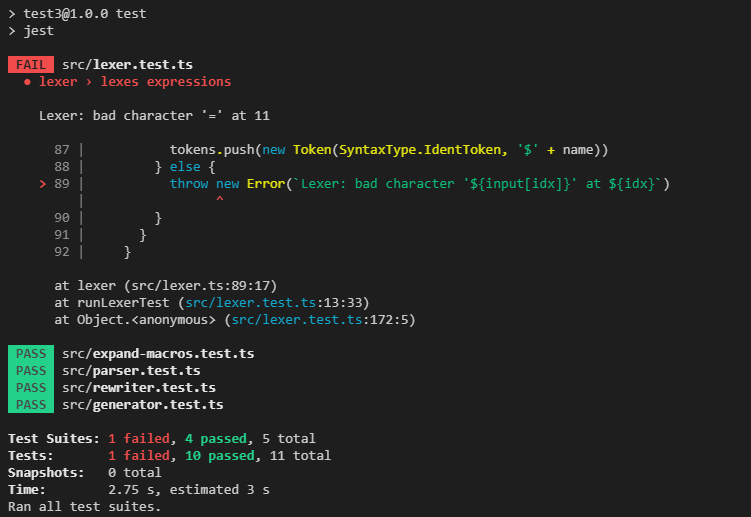
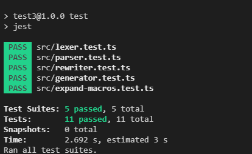
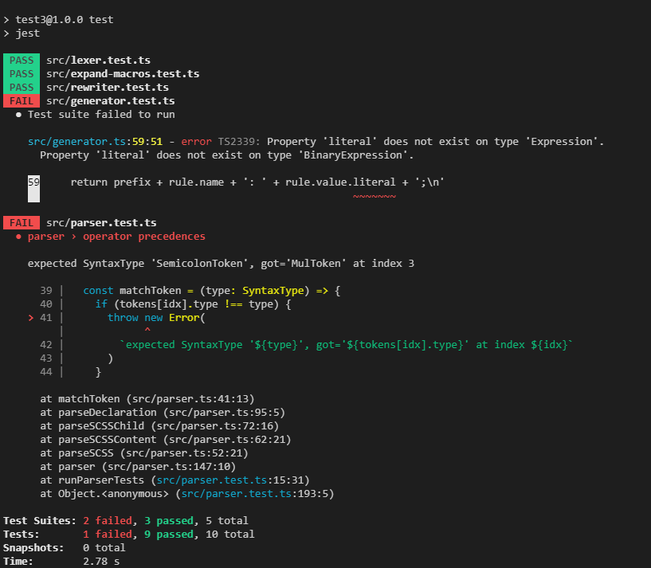
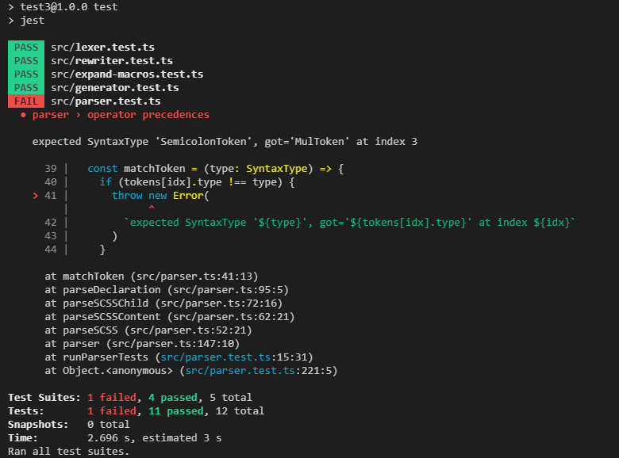
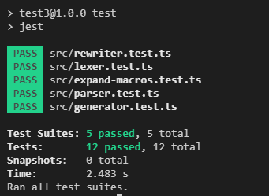
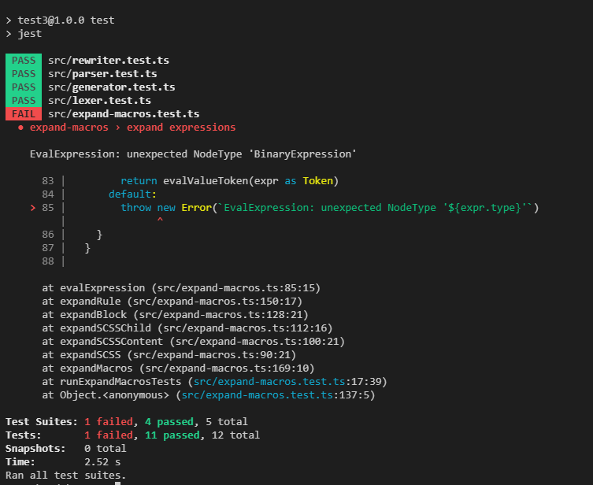
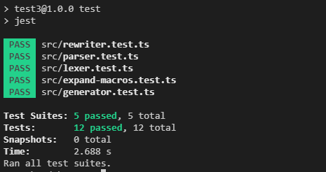

## 1. 解析二元操作符词法单元

还是先从`lexer`入手让它能解析操作符，让我们添加一些测试用例

/src/lexer.test.ts

```typescript
describe('lexer', () => {
  [...]

  test('lexes expressions', () => {
    const tests: LexerTestCase[] = [
      {
        input: `
        a == b
        $a == 1
        b != a
        a + 3
        a - 3
        a * 3
        a / 3
        a % 3
        `,
        expectedTokens: [
          [SyntaxType.NameToken, 'a'],
          [SyntaxType.EqualsEqualsToken, '=='],
          [SyntaxType.NameToken, 'b'],
          [SyntaxType.IdentToken, '$a'],
          [SyntaxType.EqualsEqualsToken, '=='],
          [SyntaxType.ValueToken, '1'],
          [SyntaxType.NameToken, 'b'],
          [SyntaxType.BangEqualsToken, '!='],
          [SyntaxType.NameToken, 'a'],
          [SyntaxType.NameToken, 'a'],
          [SyntaxType.PlusToken, '+'],
          [SyntaxType.ValueToken, '3'],
          [SyntaxType.NameToken, 'a'],
          [SyntaxType.MinusToken, '-'],
          [SyntaxType.ValueToken, '3'],
          [SyntaxType.NameToken, 'a'],
          [SyntaxType.MulToken, '*'],
          [SyntaxType.ValueToken, '3'],
          [SyntaxType.NameToken, 'a'],
          [SyntaxType.DivToken, '/'],
          [SyntaxType.ValueToken, '3'],
          [SyntaxType.NameToken, 'a'],
          [SyntaxType.ModToken, '%'],
          [SyntaxType.ValueToken, '3'],
          [SyntaxType.EOF, '']
        ]
      }
    ]

    runLexerTests(tests)
  })
})
```

/src/SyntaxType.ts

```typescript
export enum SyntaxType {
  // Tokens
  [...]
  EqualsEqualsToken = 'EqualsEqualsToken',
  BangEqualsToken = 'BangEqualsToken',
  PlusToken = 'PlusToken',
  MinusToken = 'MinusToken',
  MulToken = 'MulToken',
  DivToken = 'DivToken',
  ModToken = 'ModToken',

  // Nodes
  [...]
}
```

运行测试，没有通过



添加以下代码后测试通过了

/src/lexer.test.ts

```typescript
export const lexer = (input: string): Token[] => {
  [...]

  while (idx < n) {
    switch (input[idx]) {
      [...]
      case '+':
        tokens.push(new Token(SyntaxType.PlusToken, '+'))
        ++idx
        break
      case '-':
        tokens.push(new Token(SyntaxType.MinusToken, '-'))
        ++idx
        break
      case '*':
        tokens.push(new Token(SyntaxType.MulToken, '*'))
        ++idx
        break
      case '/':
        tokens.push(new Token(SyntaxType.DivToken, '/'))
        ++idx
        break
      case '%':
        tokens.push(new Token(SyntaxType.ModToken, '%'))
        ++idx
        break
      case '!': {
        ++idx
        if (input[idx] === '=') {
          tokens.push(new Token(SyntaxType.BangEqualsToken, '!='))
          ++idx
        } else {
          throw new Error(`Lexer: bad character '${input[idx]}' at ${idx}`)
        }
        break
      }
      case '=': {
        ++idx
        if (input[idx] === '=') {
          tokens.push(new Token(SyntaxType.EqualsEqualsToken, '=='))
          ++idx
        } else {
          throw new Error(`Lexer: bad character '${input[idx]}' at ${idx}`)
        }
        break
      }
      [...]
    }
  }

  tokens.push(new Token(SyntaxType.EOF, ''))
  return tokens
}
```



## 2. 二元表达式的语法解析

我们不妨先尝试更改一下文法来支持二元表达式

```
SCSS               --->  SCSSContent
SCSSContent        --->  (Block | Declaration)*
Block              --->  Selector `{`
                           BlockBody
                         `}`
Selector           --->  `.`? Name
BlockBody          --->  (Rule | Block | Declaration)*
Declaration        --->  Identifier `:` Expression `;`
Identifier         --->  `$` Name
Name               --->  [a-zA-Z]+
Rule               --->  Name `:` Expression `;`
Expression         --->  BinaryExpression | PrimaryExpression
BinaryExpression   --->  PrimaryExpression Operator Expression
PrimaryExpression  --->  Name | Value | Identifier
Operator           --->  `+` | `-` | `*` | `/` | `%` | `==` | `!=`
Value              --->  [0-9]+ Name?
```

如果你知道相关的原理的话就知道上面解析`Expression`的文法存在二义性，以及左递归问题,但是我们并不打算用传统的自顶向下预测分析的语法分析来实现二元表达式，因为那样会增加很多额外的非终结符和产生式，且会让文法的可读性降低 ,
比如就以二元表达式来说要想用文法表达式不同符号的优先级他的文法可能是像这样的

```
E -> E + T
T -> T * F | F
F -> Identifier
```

为了解决左递归问题要将上述文法改造为如下

```
E  -> TE`
E` -> + TE` | ε
T  -> FT`
T` -> * FT` | ε
F  -> (E) | Identifier
```

要注意上面还只有`+`和`*`两种优先级，要是优先级更多的话文法会变得更加复杂

让我们为`parser`添加一些测试用例

/src/SyntaxType.ts

```typescript
export enum SyntaxType {
  [...]
  // Nodes
  [...]
  BinaryExpression = 'BinaryExpression'
}
```

/src/parser.test.ts

```typescript
[...]

describe('parser', () => {
  [...]

  test('operator precedences', () => {
    const tests: ParserTestCase[] = [
      {
        input: `
        $a: 3 * 2 + 4px;
        $b: 3 + 2 * 4px;
        $c: a == b;
        $d: a != b;
        $e: 3 % 1 == 2;
        $f: 3 != 3 % 1;
        $g: a + b * c / 4 % 5 - 1;
        `,
        expectedAST: {
          type: SyntaxType.SCSS,
          content: [
            {
              type: SyntaxType.Declaration,
              name: '$a',
              expression: {
                type: SyntaxType.BinaryExpression,
                left: new BinaryExpression(
                  new Token(SyntaxType.ValueToken, '3'),
                  new Token(SyntaxType.MulToken, '*'),
                  new Token(SyntaxType.ValueToken, '2')
                ),
                operator: new Token(SyntaxType.PlusToken, '+'),
                right: new Token(SyntaxType.ValueToken, '4px')
              }
            },
            {
              type: SyntaxType.Declaration,
              name: '$b',
              expression: {
                type: SyntaxType.BinaryExpression,
                left: new Token(SyntaxType.ValueToken, '3'),
                operator: new Token(SyntaxType.PlusToken, '+'),
                right: new BinaryExpression(
                  new Token(SyntaxType.ValueToken, '2'),
                  new Token(SyntaxType.MulToken, '*'),
                  new Token(SyntaxType.ValueToken, '4px')
                )
              }
            },
            {
              type: SyntaxType.Declaration,
              name: '$c',
              expression: new BinaryExpression(
                new Token(SyntaxType.NameToken, 'a'),
                new Token(SyntaxType.EqualsEqualsToken, '=='),
                new Token(SyntaxType.NameToken, 'b')
              )
            },
            {
              type: SyntaxType.Declaration,
              name: '$d',
              expression: new BinaryExpression(
                new Token(SyntaxType.NameToken, 'a'),
                new Token(SyntaxType.BangEqualsToken, '!='),
                new Token(SyntaxType.NameToken, 'b')
              )
            },
            {
              type: SyntaxType.Declaration,
              name: '$e',
              expression: {
                type: SyntaxType.BinaryExpression,
                left: new BinaryExpression(
                  new Token(SyntaxType.ValueToken, '3'),
                  new Token(SyntaxType.ModToken, '%'),
                  new Token(SyntaxType.ValueToken, '1')
                ),
                operator: new Token(SyntaxType.EqualsEqualsToken, '=='),
                right: new Token(SyntaxType.ValueToken, '2')
              }
            },
            {
              type: SyntaxType.Declaration,
              name: '$f',
              expression: {
                type: SyntaxType.BinaryExpression,
                left: new Token(SyntaxType.ValueToken, '3'),
                operator: new Token(SyntaxType.BangEqualsToken, '!='),
                right: new BinaryExpression(
                  new Token(SyntaxType.ValueToken, '3'),
                  new Token(SyntaxType.ModToken, '%'),
                  new Token(SyntaxType.ValueToken, '1')
                )
              }
            },
            {
              type: SyntaxType.Declaration,
              name: '$g',
              expression: {
                type: SyntaxType.BinaryExpression,
                left: {
                  type: SyntaxType.BinaryExpression,
                  left: new Token(SyntaxType.NameToken, 'a'),
                  operator: new Token(SyntaxType.PlusToken, '+'),
                  right: {
                    type: SyntaxType.BinaryExpression,
                    left: {
                      type: SyntaxType.BinaryExpression,
                      left: {
                        type: SyntaxType.BinaryExpression,
                        left: new Token(SyntaxType.NameToken, 'b'),
                        operator: new Token(SyntaxType.MulToken, '*'),
                        right: new Token(SyntaxType.NameToken, 'c')
                      },
                      operator: new Token(SyntaxType.DivToken, '/'),
                      right: new Token(SyntaxType.ValueToken, '4')
                    },
                    operator: new Token(SyntaxType.ModToken, '%'),
                    right: new Token(SyntaxType.ValueToken, '5')
                  }
                },
                operator: new Token(SyntaxType.MinusToken, '-'),
                right: new Token(SyntaxType.ValueToken, '1')
              }
            }
          ]
        }
      }
    ]

    runParserTests(tests)
  })
})

```

/src/parser.ts

```typescript
[...]
export type Expression = Token | BinaryExpression

[...]

export class BinaryExpression {
  readonly type = SyntaxType.BinaryExpression
  constructor(
    public left: Expression,
    public operator: Token,
    public right: Expression
  ) {}
}

[...]
```

再次运行测试



会发现`generator`模块出现了一个类型错误，并且 parser 的测试也没有通过，第一个类型错误很好理解应该以前的`Expression`类型只有`Token`一种现在还多了一种`BinaryExpression`但是他有没有`literal`字段,让我们修正这个问题(实际上到`generate`的时候他一定是`Token`类型应为在宏拓展阶段我们会将`BinaryExpression`求值并替换为一个`Token`)

/src/generator..ts

```typescript
export const generator = (scss: SCSS): string => {
  [...]

  const generateRule = (rule: Rule): string => {
    const prefix = ' '.repeat(ident * identUnit)
    if (
      rule.expression.type !== SyntaxType.ValueToken &&
      rule.expression.type !== SyntaxType.NameToken
    ) {
      throw new Error(
        `GenerateRule: unexpected rule.value.type '${rule.expression.type}'`
      )
    }
    return prefix + rule.name + ': ' + rule.expression.literal + ';\n'
  }

  return generateSCSS(scss)
}
```

我们在取`rule.value.literal`之前先对他的类型进行了判断,类型报错消失了，再次运行测试


发现只剩下一个错误了，说是期望是`SemicolonToken`但是得到了`MulToken`这个也很好理解，之前定义`Declaration`的时候它右边的值是`Token`现在如果用来解析二元表达式的话会出现问题,现在就开始动手编写二元表达式的解析逻辑

/src/parser.ts

```typescript
[...]

export const parser = (tokens: Token[]): SCSS => {
  [...]

  const getBinaryOperatorPrecedence = (token: Token): number => {
    switch (token.type) {
      case SyntaxType.BangEqualsToken:
      case SyntaxType.EqualsEqualsToken:
        return 1
      case SyntaxType.PlusToken:
      case SyntaxType.MinusToken:
        return 2
      case SyntaxType.MulToken:
      case SyntaxType.DivToken:
      case SyntaxType.ModToken:
        return 3
      default:
        return 0
    }
  }

  const parsePrimaryExpression = (): Expression => {
    const token = tokens[idx]
    switch (token.type) {
      case SyntaxType.IdentToken:
      case SyntaxType.NameToken:
      case SyntaxType.ValueToken:
        ++idx
        return token
      default:
        throw new Error(`ParseExpression: unexpected NodeType '${token.type}'`)
    }
  }

  const parseBinaryExpression = (parentPrecedence: number): Expression => {
    let left = parsePrimaryExpression()

    while (true) {
      const operator = tokens[idx]
      const precedence = getBinaryOperatorPrecedence(operator)
      if (precedence <= parentPrecedence) {
        break
      }

      ++idx
      const right = parseBinaryExpression(precedence)
      left = new BinaryExpression(left, operator, right)
    }

    return left
  }

  const parseExpression = (): Expression => {
    return parseBinaryExpression(0)
  }

  return parseSCSS()
}
```

修改`Expression`的`parse`逻辑后测试通过了



可以看到新增了一个`getBinaryOperatorPrecedence`函数来区分不同操作符的优先级，从而在`parseBinaryExpression`影响一个操作符的结合性，我想你应该看出这种做法的优势了，如果把一切都用文法来表示，我们会增加很多的非终结符号，而且为了能够让文法能够无二义性的递推，我们必须用一系列的手段来改造文法，让文法可读性的更糟糕。如果还不理解可以尝试用上面的方法去做一下[这一题](https://leetcode.cn/problems/basic-calculator-ii/)这是[参考答案](https://github.com/PiNengShaoNian/algorithm-training-program/blob/main/src/string-and-array/basic-calculator-ii.cpp)

## 3. 宏拓展阶段对二元表达式求值

按照惯例先添加测试用例

/src/expand-macros.test.ts

```typescript
describe('expand-macros', () => {
  [...]

  test('expand expressions', () => {
    const tests: ExpandMacrosTestCase[] = [

      [...]

      {
        input: `
        .container {
          height: 3 + 4 * 5px;
          height: 3 * 4 + 5px;
          height: 5 / 2px;
          height: 1 - 10 % 3px;
          $a: 3 * 3px;
          $b: $a * 3 / 3;
          height: $b;
        }
        `,
        expectedAST: {
          type: SyntaxType.SCSS,
          content: [
            {
              type: SyntaxType.Block,
              selector: '.container',
              body: [
                new Rule('height', new Token(SyntaxType.ValueToken, '23px')),
                new Rule('height', new Token(SyntaxType.ValueToken, '17px')),
                new Rule('height', new Token(SyntaxType.ValueToken, '2.5px')),
                new Rule('height', new Token(SyntaxType.ValueToken, '0px')),
                new Rule('height', new Token(SyntaxType.ValueToken, '9px')),
              ],
            },
          ],
        },
      },
    ]

    runExpandMacrosTests(tests)
  })
})

```

运行测试



可以看到测试不通过，说是在求值是遇到了未知的类型的`Expression`二分表达式,我们现在就去加上

```typescript
[...]

type SCSSObject = StringObject | NumberObject | BooleanObject

enum SCSSObjectType {
  String = 'String',
  Number = 'Number',
  Boolean = 'Boolean',
}

class BooleanObject {
  readonly type = SCSSObjectType.Boolean
  constructor(public value: boolean) {}
  toString = () => this.value + ''
}

export const expandMacros = (scss: SCSS): SCSS => {
  [...]

  const executeNumberBinaryOperator = (
    left: SCSSObject,
    operator: Token,
    right: SCSSObject
  ): SCSSObject => {
    if (
      left.type !== SCSSObjectType.Number ||
      right.type !== SCSSObjectType.Number
    ) {
      throw new Error(
        `ExecuteNumberBinaryOperator: unexpected operand type, '${left.type}'' '${operator.literal}'' '${right.type}'`
      )
    }

    if (left.unit !== null && right.unit !== null && left.unit !== right.unit) {
      throw new Error(
        `ExecuteNumberBinaryOperator: incompatible unit '${JSON.stringify(
          left
        )}' and '${JSON.stringify(right)}'`
      )
    }

    const unit = left.unit ?? right.unit
    switch (operator.type) {
      case SyntaxType.PlusToken:
        return new NumberObject(left.value + right.value, unit)
      case SyntaxType.MinusToken:
        return new NumberObject(left.value - right.value, unit)
      case SyntaxType.MulToken:
        return new NumberObject(left.value * right.value, unit)
      case SyntaxType.DivToken:
        return new NumberObject(left.value / right.value, unit)
      case SyntaxType.ModToken:
        return new NumberObject(left.value % right.value, unit)
      default:
        throw new Error(
          `ExecuteNumberBinaryOperator: unexpected operator type '${operator.type}'`
        )
    }
  }

  const evalBinaryExpression = (
    bs: BinaryExpression,
    scope: Scope
  ): SCSSObject => {
    const { left, right, operator } = bs

    const leftObj = evalExpression(left, scope)
    const rightObj = evalExpression(right, scope)
    switch (operator.type) {
      case SyntaxType.EqualsEqualsToken:
        return new BooleanObject(leftObj.value === rightObj.value)
      case SyntaxType.BangEqualsToken:
        return new BooleanObject(leftObj.value !== rightObj.value)
      case SyntaxType.PlusToken:
      case SyntaxType.MinusToken:
      case SyntaxType.MulToken:
      case SyntaxType.DivToken:
      case SyntaxType.ModToken:
        return executeNumberBinaryOperator(leftObj, operator, rightObj)
      default:
        throw new Error(
          `EvalBinaryExpression: unexpected operator type ${operator.type}`
        )
    }
  }

  const evalExpression = (expr: Expression, scope: Scope) => {
    switch (expr.type) {
      [...]
      case SyntaxType.BinaryExpression:
        return evalBinaryExpression(expr as BinaryExpression, scope)
      default:
        throw new Error(`EvalExpression: unexpected NodeType '${expr.type}'`)
    }
  }

  const globalScope = new Scope(null)
  return expandSCSS(scss, globalScope)
}

```

二元表达式的求值很简单，先把左右操作数求值出来再根据操作符的类型对两个操作数进行相应的操作即可，我们现在之考虑了数字的二元表达式求值，如果想添加字符串支持那也是信手拈来的事情，由于我们还支持`==`和`!=`操作符它们会产生布尔值，所以又在内部数据表示中添加了`BooleanObject`类型,再次运行测试，成功通过



到目前位置，这一节的内容就完成了，我们实现了二元表达式的词法和语法解析，又在宏拓展阶段对他们成功求值，不过由于布尔值的使用只能出现在分支语句中我们现在还不能测试它，接下来可以开始着手`mixin`的实现了
