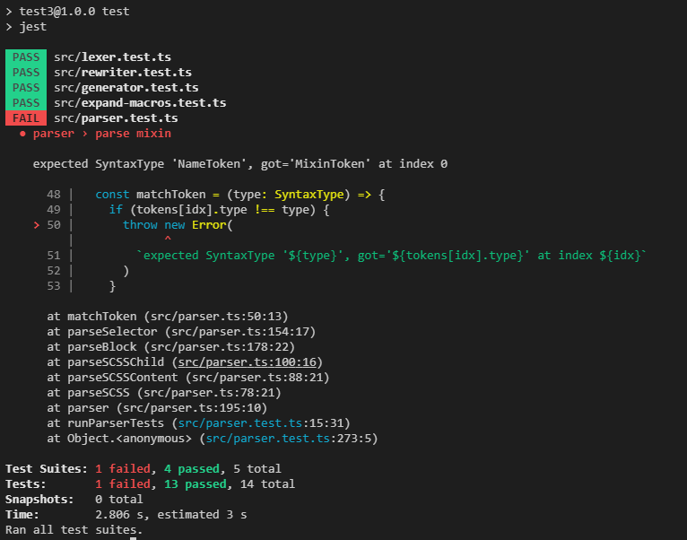

## 1. 解析 @mixin 词法单元

还是先从`lexer`入手，让我们添加一些测试用例

/src/lexer.test.ts

```typescript
describe('lexer', () => {
  [...]

  test('lexes keywords', () => {
    const tests: LexerTestCase[] = [
      {
        input: '@mixin foo($a, $b) {}',
        expectedTokens: [
          [SyntaxType.MixinToken, '@mixin'],
          [SyntaxType.NameToken, 'foo'],
          [SyntaxType.LParenToken, '('],
          [SyntaxType.IdentToken, '$a'],
          [SyntaxType.CommaToken, ','],
          [SyntaxType.IdentToken, '$b'],
          [SyntaxType.RParenToken, ')'],
          [SyntaxType.LBraceToken, '{'],
          [SyntaxType.RBraceToken, '}'],
          [SyntaxType.EOF, '']
        ]
      }
    ]

    runLexerTests(tests)
  })
})
```

./src/SyntaxType.ts

```typescript
export enum SyntaxType {
  // Tokens
  [...]
  RParenToken = 'RParenToken',
  LParenToken = 'LParenToken',
  CommaToken = 'CommaToken',
  MixinToken = 'MixinToken',

  [...]
}
```


添加以下逻辑后测试通过了
/src/lexer.ts

```typescript
export const lexer = (input: string): Token[] => {
  [...]

  const getKeywordType = (keyword: string): SyntaxType | null => {
    switch (keyword) {
      case 'mixin':
        return SyntaxType.MixinToken
      default:
        return null
    }
  }
  while (idx < n) {
    switch (input[idx]) {
      [...]
      case '(':
        tokens.push(new Token(SyntaxType.LParenToken, '('))
        ++idx
        break
      case ')':
        tokens.push(new Token(SyntaxType.RParenToken, ')'))
        ++idx
        break
      case ',':
        tokens.push(new Token(SyntaxType.CommaToken, ','))
        ++idx
        break
      [...]
      default: {
        [...]
         else if (input[idx] === '@' && isLetter(input[idx + 1])) {
          ++idx
          const name = readName()
          const keywordType = getKeywordType(name)
          if (keywordType === null) {
            throw new Error(`Lexer: unknown keyword '${name}'`)
          }
          tokens.push(new Token(keywordType, '@' + name))
        } else {
          throw new Error(`Lexer: bad character '${input[idx]}' at ${idx}`)
        }
      }
    }
  }

  tokens.push(new Token(SyntaxType.EOF, ''))
  return tokens
}
```


## 2. 语法分析`@mixin`声明

先添加测试
/src/parser.test.ts

```typescript
describe('parser', () => {

  [...]

  test('parse mixin', () => {
    const tests: ParserTest[] = [
      {
        input: `
        @mixin test() {
        }`,
        expectedAST: {
          type: SyntaxType.SCSS,
          content: [
            {
              type: SyntaxType.Mixin,
              name: 'test',
              parameters: [],
              body: [],
            },
          ],
        },
      },
      {
        input: `
        @mixin test($a, $b) {
          height: 100px;
          .box {
            width: 30px;
          }
        }`,
        expectedAST: {
          type: SyntaxType.SCSS,
          content: [
            {
              type: SyntaxType.Mixin,
              name: 'test',
              parameters: ['$a', '$b'],
              body: [
                new Rule('height', new Token(SyntaxType.ValueToken, '100px')),
                {
                  type: SyntaxType.Block,
                  selector: '.box',
                  body: [
                    new Rule('width', new Token(SyntaxType.ValueToken, '30px')),
                  ],
                },
              ],
            },
          ],
        },
      },
    ]

    runParserTests(tests)
  })
})
```

./src/parser.ts

```typescript
[...]

export type SCSSChild = Block | Declaration | Mixin

export class Mixin {
  readonly type = SyntaxType.Mixin
  constructor(
    public name: string,
    public parameters: string[],
    public body: BlockChild[]
  ) {}
}

[...]
```

./scr/SyntaxType.ts

```typescript
export enum SyntaxType {
  [...]

  // Nodes
  [...]
  Mixin = 'Mixin'
}
```



让我们添加`mixin`的 parse 逻辑然后让测试通过

/src/parser.ts

```typescript
export const parser = (tokens: Token[]): SCSS => {
  [...]

  const parseSCSSContent = (): SCSSChild[] => {
    const content: SCSSChild[] = []

    while (tokens[idx].type !== SyntaxType.EOF) {
      const child = parseSCSSChild()
      content.push(child)
    }

    return content
  }

  const parseSCSSChild = (): SCSSChild => {
    switch (tokens[idx].type) {
      case SyntaxType.IdentToken:
        return parseDeclaration()
      case SyntaxType.MixinToken:
        return parseMixin()
      default:
        return parseBlock()
    }
  }

  const parseParameters = (): string[] => {
    const parameters: string[] = []

    while (tokens[idx].type !== SyntaxType.RParenToken) {
      const parameter = matchToken(SyntaxType.IdentToken)
      parameters.push(parameter.literal)
      if (tokens[idx].type === SyntaxType.CommaToken) {
        ++idx
      }
    }

    return parameters
  }

  const parseMixin = (): Mixin => {
    matchToken(SyntaxType.MixinToken)
    const mixinNameToken = matchToken(SyntaxType.NameToken)
    matchToken(SyntaxType.LParenToken)
    const parameters = parseParameters()
    matchToken(SyntaxType.RParenToken)
    matchToken(SyntaxType.LBraceToken)
    const body = parseBlockBody()
    matchToken(SyntaxType.RBraceToken)

    return new Mixin(mixinNameToken.literal, parameters, body)
  }

  [...]

  return parseSCSS()
}

```

运行测试，已经能成功通过了


## 3. 宏拓展阶段处理`@mixin`

`@mixin`的声明要做什么处理呢? 和声明类似它的确不会对输出产生什么影响，但是他会在符号表中添加一个标识符,后续`include`时才能找到他，让我们实现代码

/src/expand-macros.test.ts

```typescript
[...]

describe('expand-macros', () => {

  [...]

  test('expand mixin', () => {
    const tests: ExpandMacrosTestCase[] = [
      {
        input: `
        @mixin test() {

        }
        `,
        expectedAST: {
          type: SyntaxType.SCSS,
          content: [],
        },
      },
    ]

    runExpandMacrosTests(tests)
  })
})
```

/src/expand-macros.test.ts

```typescript

type SCSSObject = StringObject | NumberObject | BooleanObject | MixinObject
enum SCSSObjectType {
  String = 'String',
  Number = 'Number',
  Boolean = 'Boolean',
  Mixin = 'Mixin',
}

class MixinObject {
  readonly type = SCSSObjectType.Mixin
  constructor(public value: Mixin, public scope: Scope) {}
}

export const expandMacros = (scss: SCSS): SCSS => {

  [...]

  const expandRule = (rule: Rule, scope: Scope): Rule => {
    [...]

    const obj = evalExpression(value, scope)

    if (
      obj.type !== SCSSObjectType.Number &&
      obj.type !== SCSSObjectType.String
    ) {
      throw new Error(`ExpandRule: unexpected object type ${obj.type}`)
    }

    return new Rule(
      name,
      new Token(
        obj.type === SCSSObjectType.Number
          ? SyntaxType.ValueToken
          : SyntaxType.NameToken,
        obj.toString()
      )
    )
  }

  const expandSCSSChild = (node: SCSSChild, scope: Scope): SCSSChild | null => {
    switch (node.type) {
      [...]
      case SyntaxType.Mixin:
        return expandMixin(node as Mixin, scope)
      default:
        throw new Error(
          `ExpandSCSSChild: unexpected NodeType '${(node as SCSSChild).type}'`
        )
    }
  }

  const expandMixin = (mixin: Mixin, scope: Scope): null => {
    const obj = new MixinObject(mixin, scope)
    scope.addSymbol(mixin.name, obj)
    return null
  }

  const globalScope = new Scope(null)
  return expandSCSS(scss, globalScope)
}
```

为了在作用域中添加`mixin`类型的标识符我们又新增了`MixinObject`的内部表示类型，用来存储`mixin`，注意到他有一个`scope`字段，为什么要单独保存一个`scope`字段呢?不能等它调用的时候在把调用表达式所处的`scope`传给他吗? 当然不能，应为一个`mixin`应该始终和他的词法作用域绑定,无论他被传递到哪里，无论它在哪里被调用他始终应该引用它词法作用域中的标识符，在这里最不过多赘述了，如果你了解`javascript`的话，他的词法作用域就是该`mixin`声明所在的作用域,所以在`expandMixin`中可以直接初始化出`MixinObject`并将它添加到`scope`中，再次运行测试，全部成功通过。


