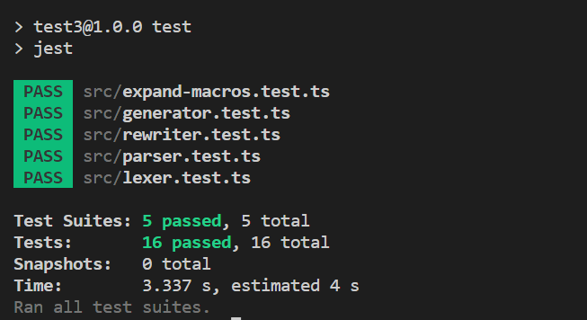
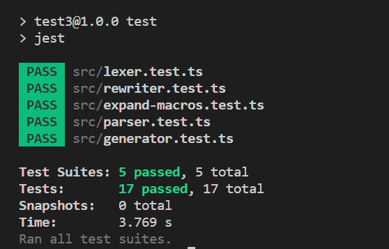
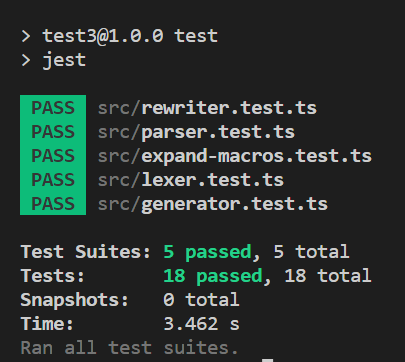

要想让词法解析器支持`@include`非常简单，只需要改几行代码
/src/SyntaxType.ts

```typescript
export enum SyntaxType {
  // Tokens
  [...]
  IncludeToken = 'IncludeToken',

  [...]
}
```

/src/lexer.test.ts

```typescript
describe('lexer', () => {
  [...]

  test('lexes include', () => {
    const tests: LexerTestCase[] = [
      {
        input: `
        @include test();
        @include test(1, 2);
        @include test((1 + 2) * 3, 4px, $a);
        `,
        expectedTokens: [
          [SyntaxType.IncludeToken, '@include'],
          [SyntaxType.NameToken, 'test'],
          [SyntaxType.LParenToken, '('],
          [SyntaxType.RParenToken, ')'],
          [SyntaxType.SemicolonToken, ';'],

          [SyntaxType.IncludeToken, '@include'],
          [SyntaxType.NameToken, 'test'],
          [SyntaxType.LParenToken, '('],
          [SyntaxType.ValueToken, '1'],
          [SyntaxType.CommaToken, ','],
          [SyntaxType.ValueToken, '2'],
          [SyntaxType.RParenToken, ')'],
          [SyntaxType.SemicolonToken, ';'],

          [SyntaxType.IncludeToken, '@include'],
          [SyntaxType.NameToken, 'test'],
          [SyntaxType.LParenToken, '('],
          [SyntaxType.LParenToken, '('],
          [SyntaxType.ValueToken, '1'],
          [SyntaxType.PlusToken, '+'],
          [SyntaxType.ValueToken, '2'],
          [SyntaxType.RParenToken, ')'],
          [SyntaxType.MulToken, '*'],
          [SyntaxType.ValueToken, '3'],
          [SyntaxType.CommaToken, ','],
          [SyntaxType.ValueToken, '4px'],
          [SyntaxType.CommaToken, ','],
          [SyntaxType.IdentToken, '$a'],
          [SyntaxType.RParenToken, ')'],
          [SyntaxType.SemicolonToken, ';'],

          [SyntaxType.EOF, '']
        ]
      }
    ]

    runLexerTests(tests)
  })
})

```

./src/lexer.ts

```typescript
export const lexer = (input: string): Token[] => {
  [...]

  const getKeywordType = (keyword: string): SyntaxType | null => {
    switch (keyword) {
      case 'mixin':
        return SyntaxType.MixinToken
      case 'include':
        return SyntaxType.IncludeToken
      default:
        return null
    }
  }

  [...]
}
```

运行测试，成功通过



接下来是语法解析
/src/parser.test.ts

```typescript
describe('parser', () => {
  [...]

  test('parse include', () => {
    const tests: ParserTestCase[] = [
      {
        input: `
            @include test();
            @include test(1, 2);
            @include test((1 + 2) * 3, 4px, $a);
            `,
        expectedAST: {
          type: SyntaxType.SCSS,
          content: [
            {
              type: SyntaxType.Include,
              name: 'test',
              args: []
            },
            {
              type: SyntaxType.Include,
              name: 'test',
              args: [
                new Token(SyntaxType.ValueToken, '1'),
                new Token(SyntaxType.ValueToken, '2')
              ]
            },
            {
              type: SyntaxType.Include,
              name: 'test',
              args: [
                {
                  type: SyntaxType.BinaryExpression,
                  left: {
                    type: SyntaxType.BinaryExpression,
                    left: new Token(SyntaxType.ValueToken, '1'),
                    operator: new Token(SyntaxType.PlusToken, '+'),
                    right: new Token(SyntaxType.ValueToken, '2')
                  },
                  operator: new Token(SyntaxType.MulToken, '*'),
                  right: new Token(SyntaxType.ValueToken, '3')
                },
                new Token(SyntaxType.ValueToken, '4px'),
                new Token(SyntaxType.IdentToken, '$a')
              ]
            }
          ]
        }
      }
    ]

    runParserTests(tests)
  })
})

```

/src/SyntaxType.ts

```typescript
export enum SyntaxType {
  [...]

  // Nodes
  [...]
  Include = 'Include'
}
```

/src/parser.ts

```typescript
import { Token } from './lexer'
import { SyntaxType } from './SyntaxType'

export type SCSSChild = Block | Declaration | Mixin | Include

export class Include {
  readonly type = SyntaxType.Include
  constructor(public name: string, public args: Expression[]) {}
}

export const parser = (tokens: Token[]): SCSS => {
  [...]

  const parseSCSSChild = (): SCSSChild => {
    switch (tokens[idx].type) {
      [...]
      case SyntaxType.IncludeToken:
        return parseInclude()
      default:
        return parseBlock()
    }
  }

  const parseArguments = (): Expression[] => {
    const args: Expression[] = []

    while (tokens[idx].type !== SyntaxType.RParenToken) {
      const arg = parseExpression()
      args.push(arg)
      if (tokens[idx].type === SyntaxType.CommaToken) {
        ++idx
      }
    }

    return args
  }

  const parseInclude = (): Include => {
    matchToken(SyntaxType.IncludeToken)
    const nameToken = matchToken(SyntaxType.NameToken)
    matchToken(SyntaxType.LParenToken)
    const args = parseArguments()
    matchToken(SyntaxType.RParenToken)
    matchToken(SyntaxType.SemicolonToken)

    return new Include(nameToken.literal, args)
  }

  const parsePrimaryExpression = (): Expression => {
    const token = tokens[idx]
    switch (token.type) {
      [...]
      case SyntaxType.LParenToken: {
        ++idx
        const expr = parseExpression()
        matchToken(SyntaxType.RParenToken)
        return expr
      }
      default:
        throw new Error(`ParseExpression: unexpected NodeType '${token.type}'`)
    }
  }


  return parseSCSS()
}
```

再次运行测试，成功通过



开始宏拓展阶段
/src/expand-macros.test.ts

```typescript
[...]

describe('expand-macros', () => {
  [...]

  test('expand mixin', () => {
    const tests: ExpandMacrosTestCase[] = [
      [...]

      {
        input: `
        $border-color: pink;
        @mixin color($fc, $bc) {
          color: $fc;
          background-color: $bc;
          border-color: $border-color;
        }

        .container {
          @include color(red, blue);
        }

        .box {
          @include color(indigo, purple);
        }
        `,
        expectedAST: {
          type: SyntaxType.SCSS,
          content: [
            {
              type: SyntaxType.Block,
              selector: '.container',
              body: [
                new Rule('color', new Token(SyntaxType.NameToken, 'red')),
                new Rule(
                  'background-color',
                  new Token(SyntaxType.NameToken, 'blue')
                ),
                new Rule(
                  'border-color',
                  new Token(SyntaxType.NameToken, 'pink')
                )
              ]
            },
            {
              type: SyntaxType.Block,
              selector: '.box',
              body: [
                new Rule('color', new Token(SyntaxType.NameToken, 'indigo')),
                new Rule(
                  'background-color',
                  new Token(SyntaxType.NameToken, 'purple')
                ),
                new Rule(
                  'border-color',
                  new Token(SyntaxType.NameToken, 'pink')
                )
              ]
            }
          ]
        }
      }
    ]

    runExpandMacrosTests(tests)
  })
})
```

/src/generator.test.ts

```typescript
[...]

describe('generator', () => {
  [...]

  test('generate mixin and include', () => {
    const tests: GeneratorTestCase[] = [
      {
        input: `
        @mixin color($fg, $bg) {
          color: $fg;
          background-color: $bg;
        }
        @mixin center() {
          display: flex;
          justify-content: center;
          align-items: center;
        }

        .container {
          margin: 10px;
          @mixin avatar($round, $w) {
            @include center();
            border-radius: $round;
            width: $w;
            height: $w;
          }
          .box {
            @include avatar(50px, 100px);
            @include color(red, blue);
            box-sizing: border-box;
          }
        }`,
        expected: `
        .container {
          margin: 10px;
        }
        .container .box {
          display: flex;
          justify-content: center;
          align-items: center;
          border-radius: 50px;
          width: 100px;
          height: 100px;
          color: red;
          background-color: blue;
          box-sizing: border-box;
        }`
      }
    ]

    runGeneratorTests(tests)
  })
})
```

/src/expand-macros.ts

```typescript
import {
  [...]

  Include
} from './parser'

export const expandMacros = (scss: SCSS): SCSS => {
  const extendScope = (
    obj: MixinObject,
    execScope: Scope,
    args: Expression[]
  ): Scope => {
    const extendedScope = new Scope(obj.scope)
    const parameters = obj.value.parameters

    if (parameters.length !== args.length) {
      throw new Error(
        `ExtendScope: ${obj.value.name} want ${
          parameters.length
        } arguments, got=${args.length} (${JSON.stringify(args)})`
      )
    }

    for (let i = 0; i < parameters.length; ++i) {
      const arg = evalExpression(args[i], execScope)
      const parameter = parameters[i]
      extendedScope.addSymbol(parameter, arg)
    }

    return extendedScope
  }

  const expandSCSSContent = (
    content: SCSSChild[],
    scope: Scope
  ): SCSSChild[] => {
    const children: SCSSChild[] = []
    for (const node of content) {
      const child = expandSCSSChild(node, scope)
      if (Array.isArray(child)) {
        children.push(...child)
      } else if (child !== null) {
        children.push(child)
      }
    }

    return children
  }

  const expandSCSSChild = (
    node: SCSSChild,
    scope: Scope
  ): SCSSChild | SCSSChild[] | null => {
    switch (node.type) {
      [...]

      case SyntaxType.Include:
        return expandInclude(node, scope) as SCSSChild[]
      default:
        throw new Error(
          `ExpandSCSSChild: unexpected NodeType '${(node as SCSSChild).type}'`
        )
    }
  }

  const expandInclude = (include: Include, scope: Scope): BlockChild[] => {
    const mixinObj = scope.lookup(include.name)
    if (mixinObj === null || mixinObj.type !== SCSSObjectType.Mixin) {
      throw new Error(`ExpandInclude: Mixin '${include.name}' is not defined`)
    }
    const extendedScope = extendScope(mixinObj, scope, include.args)
    const dummyBlock = new Block('', mixinObj.value.body)
    const expandedBlock = expandBlock(dummyBlock, extendedScope)

    return expandedBlock.body
  }

  const expandBlock = (block: Block, scope: Scope): Block => {
    const body: BlockChild[] = []
    const blockScope = new Scope(scope)
    for (const node of block.body) {
      switch (node.type) {
        [...]
        default: {
          const child = expandSCSSChild(node, blockScope)
          if (Array.isArray(child)) {
            body.push(...child)
          } else if (child !== null) {
            body.push(child)
          }
        }
      }
    }

    return new Block(block.selector, body)
  }

  const globalScope = new Scope(null)
  return expandSCSS(scss, globalScope)
}
```

运行测试，成功通过，每次执行一个`mixin`中的语句时我们会先调用`extendScope`用他的词法作用域创建出一个拓展的作用域，会把传给他的参数也放在其中，这样它其中的语句就能同时访问到它的参数以及它词法作用域中的标识符了


